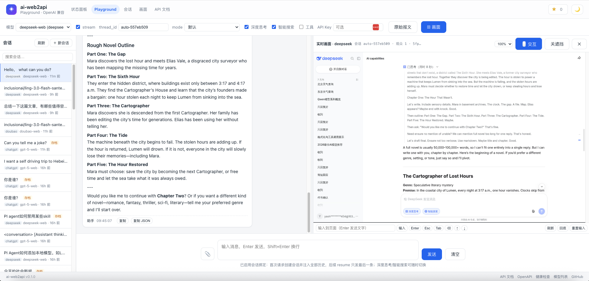

# ai-web2api

**English** | [中文](README.zh-CN.md)

[](LICENSE)
[](pyproject.toml)



Turn **web-only AI chat products** (DeepSeek, ChatGPT, Doubao, …) into an **OpenAI-compatible API**.

> 仅供个人学习交流。

How it works: Playwright drives a real browser — opens the page, keeps the session alive, types the message, incrementally extracts the streaming answer — and exposes it as OpenAI's `/v1/chat/completions`. No internal API reverse-engineering: pure DOM automation, so when a site changes you only update selectors in the config.

**Web UI at `/ui/`**: [status dashboard](docs/UI.md#status-dashboard), [Playground](docs/UI.md#playground), [Threads](docs/UI.md#threads), [Live view](docs/UI.md#live-view--交互). Light/dark theme.

## Features

- OpenAI-compatible API (`/v1/chat/completions` streaming + non-streaming, `/v1/models`) — drop-in with OpenAI SDK
- Multi-provider, real-browser automation — no internal API reverse-engineering; site redesign → update selectors only
- Login state survives restarts (`storage_state` + localStorage fingerprint); auth-expiry countdown
- Streaming, thinking, attachments, function calling（实验性质，不建议大量使用）
- Built-in web UI: status dashboard, Playground, Threads, Live view

## Supported providers

| Provider | Status | Models | Login | Docs |
|---|---|---|---|---|
| DeepSeek | ✅ default | `deepseek-web`, `deepseek-r1-web` | auto / manual | |
| ChatGPT | ✅ headful only | `gpt-5-web`, `gpt-4o-web`, `o3-web` | manual (Google OAuth) | |
| Kimi | ✅ | `kimi-web` | manual (WeChat QR) | [docs](docs/PROVIDER_KIMI.md) |
| Doubao | ✅ | `doubao-web` | manual (phone/QR) | [docs](docs/PROVIDER_DOUBAO.md) |
| GLM | ⚠️ disabled | `glm-web` | manual (Aliyun WAF) | [docs](docs/PROVIDER_GLM.md) |
| Gemini | ✅ guest | `gemini-web` | guest | [docs](docs/PROVIDER_GEMINI.md) |
| Qwen | ⚠️ unstable/slow/login often blocked | `qwen3.7-plus-web` | auto / manual | |

> Qwen: disabled by default (`enabled: false`). Full provider details → [`docs/`](docs/).

## Quick start

### Docker Compose (recommended; image ships Chromium)

```bash
cp .env.example .env                          # fill DEEPSEEK_USERNAME/PASSWORD (optional; manual login works too)
docker compose up -d --build
docker compose logs -f                        # clickable UI/API URLs printed
```

- Login state / threads / history persist in the named volume `web2api-profiles` — `docker compose down -v` wipes them
- Config is bind-mounted: edit `config.yaml` → `docker compose restart` (no rebuild)
- ChatGPT needs `WEB2API_HEADLESS=false` (Sentinel blocks headless; runs headful under Xvfb)
- No auth by default — bind `0.0.0.0` + reverse proxy if exposing; set `WEB2API_API_KEY` for `/v1/*`

### Local dev

```bash
uv sync
.venv/bin/python -m playwright install chromium
.venv/bin/python -m ai_web2api.main           # URLs printed on startup
```

### Sign in

**Auto** (`login.mode: auto` + `.env` credentials) or **manual**:

```bash
./scripts/login.sh chatgpt        # one-command; auto-imports into running service
ai-web2api login chatgpt          # short form after pip install -e .
```

Login state saved to `profiles/<provider>/state.json`, restored on restart.

### Call the API

```python
from openai import OpenAI
client = OpenAI(base_url="http://127.0.0.1:8000/v1", api_key="unused")
resp = client.chat.completions.create(
    model="deepseek-web",
    messages=[{"role": "user", "content": "Hi"}],
)
```

## Thread binding (`thread_id`, optional)

Pass `thread_id` to reuse the same web conversation across requests (page holds history; only last user message sent). Server-side: serial per thread, parallel across threads, TTL reclamation, cross-restart persistence.

```bash
curl http://127.0.0.1:8000/v1/chat/completions \
  -H 'Content-Type: application/json' \
  -d '{"model": "deepseek-web", "thread_id": "my-chat", "messages": [{"role": "user", "content": "My name is Ming"}]}'
```

- `thread_id` is client-defined (server echoes it back; `X-Thread-Id` header also works)
- Management: `GET /admin/threads` / `GET /admin/threads/{id}/messages` / `DELETE /admin/threads/{id}`
- Switching model on a bound thread → 409, Playground auto-detaches and starts fresh
- See [`docs/THREADS.md`](docs/THREADS.md) for details

## Configuration

Key fields (`config.yaml`):

```yaml
server:
  host: 127.0.0.1
  port: 8000
  function_calling: true
browser:
  headless: true
  locale: zh-CN
providers:
  deepseek:
    url: https://chat.deepseek.com
    models:
      - {name: deepseek-web, ui_label: "DeepSeek 最新版"}
    selectors:             # site redesign → only touch this
      input:
        - "textarea[name=search]"
        - "textarea"
      send_button: []      # empty = Enter
    login:
      mode: auto             # auto (/.env) or manual
      username_env: DEEPSEEK_USERNAME
      password_env: DEEPSEEK_PASSWORD
```

Full field list → [`src/ai_web2api/config.py`](src/ai_web2api/config.py).

## Adding a new provider

1. Driver class under `providers/` extending `BaseProvider` (or reuse `DeepSeekProvider`)
2. Register in `registry.DRIVERS`
3. Add section to `config.yaml` (URL + models + selectors)

See [`docs/DESIGN.md`](docs/DESIGN.md) §3 for extension points.

## API

| Method | Path | Description |
|---|---|---|
| GET | `/v1/models` | Model list |
| POST | `/v1/chat/completions` | Chat completion (SSE when `stream: true`) |
| GET | `/healthz` | Health + login state |
| GET | `/admin/{p}/screen.jpg` | JPEG frame |
| GET | `/admin/{p}/stream.mjpg` | MJPEG live stream |
| GET | `/admin/{p}/screen/state` | Live view state |
| GET | `/admin/status` | Aggregated status |
| POST | `/admin/{p}/login/auto` | Auto login |
| POST | `/admin/{p}/login/start` | Open login window |
| GET/POST | `/admin/{p}/login/*` | Status / state import / cookies / logout |
| GET | `/admin/threads` | Thread list (search / filter / paginate) |
| GET | `/admin/threads/{id}/messages` | History |
| DELETE | `/admin/threads/{id}` | Force-kill + delete history |

Full docs → [`docs/`](docs/).

## Project layout

```
src/ai_web2api/
├── main.py            # FastAPI entry + background login refresh
├── config.py          # YAML → Pydantic
├── cli.py             # `ai-web2api login|providers`
├── api/               # OpenAI routes, schemas, SSE
├── browser/           # manager + DOM→Markdown extraction
├── providers/         # driver base + DeepSeek/Qwen/ChatGPT + registry
├── core/              # SerialGate, errors, ThreadManager, store, auth expiry
├── tool_calling/      # prompt injection / parsing / transcription
└── webui/             # status + Playground + Threads + Live view (HTML/CSS/JS)
scripts/
└── login.sh           # one-command manual login
```
