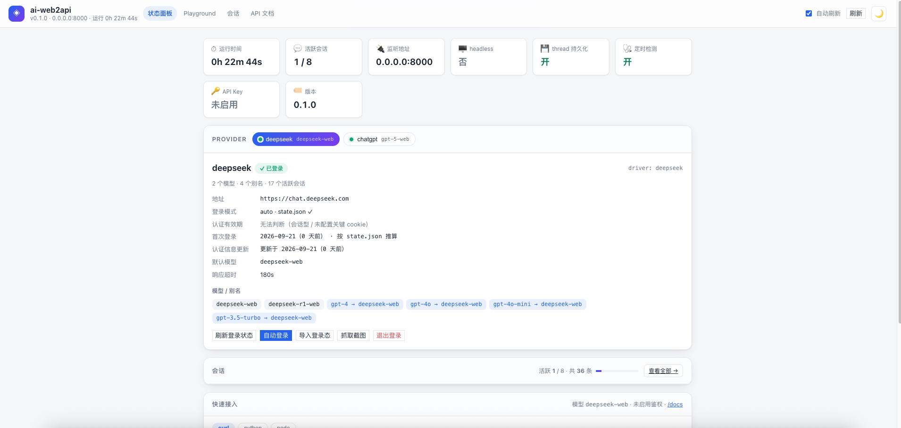

# ai-web2api

**English** | [中文](README.zh-CN.md)

[](LICENSE)
[](pyproject.toml)



Turn **web-only AI chat products** (DeepSeek, Kimi, Qwen/Tongyi, ChatGPT, …) into an **OpenAI-compatible API**.

How it works: Playwright drives a real browser — opens the page, keeps the session alive, types the message, incrementally extracts the streaming answer — and exposes it as OpenAI's `/v1/chat/completions`. No internal API reverse-engineering: pure DOM automation, so when a site changes you only update selectors in the config.

> Design docs: [`docs/DESIGN.md`](docs/DESIGN.md) (§3 covers provider extension points); Qwen in [`docs/PROVIDER_QWEN.md`](docs/PROVIDER_QWEN.md); ChatGPT in [`docs/PROVIDER_CHATGPT.md`](docs/PROVIDER_CHATGPT.md); Kimi in [`docs/PROVIDER_KIMI.md`](docs/PROVIDER_KIMI.md); auth expiry in [`docs/AUTH_EXPIRY.md`](docs/AUTH_EXPIRY.md). **DeepSeek / ChatGPT are enabled by default** (Qwen is wired up but `enabled: false`; turn it on when needed).

**Web UI at `/ui/`**: status dashboard (login state + **auth expiry countdown**, per-provider models/aliases, one-click import of login state), **Playground** (chat with streaming, thinking panel, attachment upload, function-calling tester, raw request/response + copy-as-curl, waiting indicator with elapsed seconds), a **Threads** page (search, provider filter, pagination) and a **Live view** page (read-only browser view). Light/dark theme, responsive layout.

## Features

- **OpenAI-compatible API** — `/v1/chat/completions` (streaming SSE + non-streaming) and `/v1/models`; drop-in with the OpenAI SDK, LangChain / llama_index and any OpenAI client, with optional API-key auth
- **Multi-provider, real-browser automation** — DeepSeek, ChatGPT, Doubao, GLM and Kimi (Qwen optional); Playwright drives the actual page, so a site redesign only means updating selectors in `config.yaml` — no internal API reverse engineering
- **Login state and conversations survive restarts** — `storage_state` persistence (rotated cookies **and localStorage tokens** are fingerprinted and re-saved), automatic or one-command manual login, an **auth-expiry countdown + reminder** for manual providers, and per-thread resume
- **Streaming, thinking, attachments and tools** — SSE deltas with the model's thinking kept separately as `reasoning_content`; image attachments via OpenAI-style `content` parts; function calling through `tools` / `tool_choice`, returned as standard `tool_calls`
- **Built-in web UI** (no build step, light/dark theme, responsive) — **status dashboard** (login state, auth expiry, models/aliases, one-click state import), **Playground** (streaming chat, thinking panel, attachments, tool tester, raw request/response + copy-as-curl), **Threads** page (search, provider filter, pagination) and **Live view** (read-only browser view, plus captured interactive widgets)
- **Docker-ready** — the image ships Chromium; `WEB2API_HEADLESS=false` runs headful under Xvfb for sites that insist on a real display (e.g. ChatGPT's Sentinel), and `config.yaml` is bind-mounted so config changes only need a restart

## Supported providers

| Provider | Status | Exposed models | Login | Notes |
|---|---|---|---|---|
| **DeepSeek** | ✅ **Stable — recommended default** | `deepseek-web`, `deepseek-r1-web` | `mode: auto` (username/password) or manual | Works headless. Thinking + smart-search toggles, image attachments and function calling are all verified end to end |
| **ChatGPT** | ✅ **Works — headful only** | `gpt-5-web`, `gpt-4o-web`, `o3-web` | **manual only** (no password login: Google OAuth) | Sentinel blocks headless, so it must run headful (`WEB2API_HEADLESS=false`, under Xvfb in Docker). The session token lasts ~90 days — log in once and reuse it |
| **Doubao** | ✅ **Works — manual login** | `doubao-web` | **manual only** (phone/SMS or QR; no password login) | Verified end to end (14.7s) and by the text-fidelity regression (3/3 cases, 1.00 coverage). Assistant replies are matched with a role-aware selector because `.md-box-root` also matches the user's own question; answers split across several containers are joined (`response_all_new`) and buffered (`stream_content: false`). A guest composer exists, so login state is judged by a reverse marker ([`docs/PROVIDER_DOUBAO.md`](docs/PROVIDER_DOUBAO.md)) |
| **GLM (Zhipu)** | ✅ **Works — manual WAF pass, needs keep-alive** | `glm-web` | **manual only** (phone/SMS or QR) | chatglm.cn fronts an **Aliyun WAF slider** that blocks headless *and* headful automation; passing it once by hand on the host (`./scripts/login.sh glm`) and importing the state works — the WAF cookie is reusable in the container, but it expires, so re-verify periodically. Verified end to end (19.7s, clean answer, thinking kept separate) ([`docs/PROVIDER_GLM.md`](docs/PROVIDER_GLM.md)) |
| **Kimi** | ✅ **Works — manual login** | `kimi-web` | **manual only** (WeChat QR / phone + SMS code, with a captcha) | Verified end to end: composer, send, clean answer extraction (thinking kept separate), attachments and thread resume. Content is **buffered** (thinking and the answer share one segment) and the site has no stop button, so completion relies on stability detection. Tokens live in localStorage, so `login.auth_local_storage: ["refresh_token"]` is used to read the JWT `exp` — the dashboard shows ~90 days and reminds you before it lapses |
| **Qwen / Tongyi** | ⚠️ **Experimental — unstable, slow, login easily blocked** | `qwen3.7-plus-web` | `mode: auto` or manual | **Disabled by default** (`enabled: false`; set `true` to try). The site's UI selectors change often, responses are noticeably slower, and login is frequently blocked by network/risk control — treat it as best-effort, not production |

> **Text-capture fidelity** (measured 2026-09-22): across long-form, code-block and markdown-table cases,
> **DeepSeek, ChatGPT, Kimi and Doubao scored 1.00 sentence coverage with zero thinking contamination (12/12 cases)**;
> GLM was skipped because its Aliyun WAF ticket (~30 min TTL) had expired. Method, raw results, the regression
> threshold and the two pitfalls found while running it: [`docs/TEXT_FIDELITY.md`](docs/TEXT_FIDELITY.md) (`./scripts/text_fidelity.sh`).

## Quick start

### Option 1: Docker Compose (recommended; the image ships Chromium)

```bash
cp .env.example .env          # fill DEEPSEEK_USERNAME/PASSWORD, QWEN_USERNAME/PASSWORD (optional; manual login works too)
docker compose up -d --build  # first run pulls the base image and installs deps (a few minutes)
docker compose logs -f        # watch the logs; clickable UI/API URLs are printed
```

Open `http://127.0.0.1:8000/ui/`. Notes:

- Login state / threads and message history persist in the named volume `web2api-profiles` (login state `state.json`, threads+messages in SQLite `threads.db`) — **rebuilding the container keeps you logged in and keeps history**; only `docker compose down -v` wipes it
- Inside the container you must listen on `0.0.0.0` (already the default in `config.yaml`); the host maps `${WEB2API_PUBLISH_PORT:-8000}`
- Changing selectors/config: edit `config.yaml` and run `docker compose restart` (the repo's `config.yaml` is bind-mounted into the container, so **no rebuild is needed**)
- There is no visible window inside the container, so manual login uses state import:
  `curl -X POST http://127.0.0.1:8000/admin/deepseek/login/cookies -H 'Content-Type: application/json' -d '{"cookies":[...]}'`
- For public exposure, set `WEB2API_API_KEY` (protects `/v1/*`) and restrict `/admin` behind your own reverse proxy
- **When using ChatGPT**: set `WEB2API_HEADLESS=false` (in `.env`, or `WEB2API_HEADLESS=false docker compose up -d`) → the container runs **headful under Xvfb** (Sentinel blocks headless; headful passes). Other providers are unaffected

```bash
docker compose down          # stop (keeps login state)
docker compose down -v       # stop and wipe login state
```

### Option 2: Local development

```bash
uv sync                      # install dependencies (creates .venv)
.venv/bin/python -m playwright install chromium   # install the browser
```

#### 0. Start

```bash
.venv/bin/python -m ai_web2api.main
```

On startup it prints **clickable URLs**, one per line (`0.0.0.0` just means "listen on all interfaces" — it is not a reachable hostname):

```
INFO ai_web2api: 管理界面（本机）：http://127.0.0.1:8000/ui/
INFO ai_web2api: Playground（本机）：http://127.0.0.1:8000/ui/playground.html
INFO ai_web2api: OpenAI API（本机）：http://127.0.0.1:8000/v1
INFO ai_web2api: 管理界面（局域网）：http://192.168.1.5:8000/ui/      # for phones / other machines
INFO ai_web2api: Playground（局域网）：http://192.168.1.5:8000/ui/playground.html
INFO ai_web2api: OpenAI API（局域网）：http://192.168.1.5:8000/v1
```

If the port is taken it prints one human-readable line (`启动失败：0.0.0.0:8000 无法监听（Address already in use），端口可能已被占用`) instead of a uvicorn traceback.

### 1. Sign in (required on first run)

**Option A (recommended) — automatic login**: set `login.mode: auto` in `config.yaml` and put
`DEEPSEEK_USERNAME`/`DEEPSEEK_PASSWORD` in `.env`; the service signs in on startup (headless, no window).

**Option B (recommended when a captcha / Google / slider is involved) — manual login from the CLI**
(run it on a machine that has a display; **after login it imports into the running service by default**, no restart):

```bash
# Easiest: one command (picks the interpreter, derives the import URL)
./scripts/login.sh chatgpt         # no argument → interactive provider picker

# Equivalent (short command after `pip install -e .`)
ai-web2api login chatgpt
ai-web2api providers               # list providers: mode / login state / days left on auth

# Works without installing
python -m ai_web2api.cli login chatgpt --manual
```

- **With Docker, still run this on the host** (no visible window inside the container); the script POSTs the login state to the service.
- Import URL precedence: `--import-url` > `AI_WEB2API_URL` env var > derived from `config.yaml` host/port.
  Cross-machine/container example: `AI_WEB2API_URL=http://192.168.1.10:8000 ./scripts/login.sh chatgpt`
- Omitting the provider **lists candidates** (with `manual/auto` and days left) so you can pick; `--no-import` only writes the state file.
- Writes `profiles/<provider>/state.json` (first login time is recorded in `login.json`).
- See [`docs/MANUAL_LOGIN.md`](docs/MANUAL_LOGIN.md).

**Option C — import from the `/ui` dashboard**: provider detail → "导入登录态" (import login state) → paste `state.json` or pick/drag a file.
(Endpoint: `POST /admin/{p}/login/state`, which writes to disk + resets the browser context + re-verifies login.)

**Option D (legacy) — make the window visible and log in manually** (local, non-Docker):

```bash
DEEPSEEK_HEADLESS=false .venv/bin/python -m ai_web2api.main   # or put it in .env and restart
curl -X POST http://127.0.0.1:8000/admin/deepseek/login/start    # open the login window
# … finish login in the browser that pops up (phone code / password) …
curl http://127.0.0.1:8000/admin/deepseek/login/status           # check the result
```

> `browser.headless` defaults to `true` (silent; chatting no longer pops a browser window).
> Override precedence: `WEB2API_HEADLESS` > `DEEPSEEK_HEADLESS` (i.e. `<PROVIDER>_HEADLESS`) > `config.yaml`.
> In headless mode the window opened by `login/start` is invisible, so the endpoint returns a hint instead of hanging silently.

Login state is saved to `profiles/<provider>/state.json` and restored automatically on restart (no repeated logins).

You can also import cookies directly (cookies only; use `login/state` when localStorage is needed):

```bash
curl -X POST http://127.0.0.1:8000/admin/deepseek/login/cookies \
  -H 'Content-Type: application/json' \
  -d '{"cookies": [{"name": "...", "value": "...", "domain": ".deepseek.com"}]}'
```

### 2. Call it (OpenAI-compatible)

Non-streaming:

```bash
curl http://127.0.0.1:8000/v1/chat/completions \
  -H 'Content-Type: application/json' \
  -d '{"model": "deepseek-web", "messages": [{"role": "user", "content": "Tell me a joke"}]}'
```

Streaming (SSE):

```bash
curl -N http://127.0.0.1:8000/v1/chat/completions \
  -H 'Content-Type: application/json' \
  -d '{"model": "deepseek-r1-web", "messages": [{"role": "user", "content": "1+1=?"}], "stream": true}'
```

The OpenAI SDK works as-is:

```python
from openai import OpenAI
client = OpenAI(base_url="http://127.0.0.1:8000/v1", api_key="unused")
resp = client.chat.completions.create(
    model="deepseek-web",
    messages=[{"role": "user", "content": "Hi"}],
)
print(resp.choices[0].message.content)
```

### 2.5 Thread binding (`thread_id`, optional)

By default requests are **stateless**: every request opens a new conversation and the client sends the whole history in `messages`. Pass `thread_id` to reuse **the same web conversation** across requests:

```bash
# First call: create the thread (inject the full history)
curl http://127.0.0.1:8000/v1/chat/completions \
  -H 'Content-Type: application/json' \
  -d '{"model": "deepseek-web", "thread_id": "my-chat", "messages": [{"role": "user", "content": "My name is Ming"}]}'

# Later: same thread_id reuses the same page; only the last user message is sent (the page holds the history)
curl http://127.0.0.1:8000/v1/chat/completions \
  -H 'Content-Type: application/json' \
  -d '{"model": "deepseek-web", "thread_id": "my-chat", "messages": [{"role": "user", "content": "What is my name?"}]}'
```

- `thread_id` is client-defined (the server never generates one, it only echoes it): the non-streaming `thread_id` field and the `thread_id` field on every SSE chunk echo the id bound to this request; `null` when no thread_id was given
- `X-Thread-Id` header also works; with the OpenAI SDK use `extra_body={"thread_id": "..."}` (or `extra_headers={"X-Thread-Id": "..."}`)
- The same `thread_id` runs serially; different threads run in parallel (`server.thread_parallel: false` falls back to global serial execution)
- Idle pages are reclaimed after `server.thread_ttl` (default 900s); the active-thread cap is `server.max_threads` (default 8, 429 above it)
- Management: `GET /admin/threads` (list), `GET /admin/threads/{id}/messages` (history), `DELETE /admin/threads/{id}` (force-kill and delete history; the next request with the same id recreates it)
- **Threads page** at `/ui/threads.html`: card list with titles (newest first), **text search** (title / thread_id / provider / model), provider filter, page size (20/50/100), **load more**, plus "continue in Playground" / copy id / destroy. Backed by `GET /admin/threads?q=&provider=&limit=&offset=&order=` — the response carries `total` / `has_more`, and `limit=0` (default) still returns everything, so older callers are unaffected
- Playground's left sidebar pulls from the same endpoint: clicking a thread backfills history from `GET /admin/threads/{id}/messages`; search is **server-side** (debounced), and when there are more than the loaded page it links to the Threads page
- Switching the model inside a thread returns 409 (provider+model are bound at creation); the **Playground auto-detaches** the thread for you and starts a fresh conversation instead of failing
- Busy page (previous request unfinished, the new message is queued by the site) → 409 `thread_busy` within 20s and the thread is destroyed (config `thread_busy_timeout`); the client retries later and it is recreated. Previous request never released (client aborted) → 504 `thread_timeout` within 60s and destroyed. Every request is **bounded**, nothing hangs forever
- **Cross-restart persistence** (`server.thread_persist: true`, on by default): thread metadata and message history go to SQLite (`profiles/threads.db`) — each finished turn writes its user/assistant messages (including thinking) and records the bound page's DeepSeek conversation id (last segment of `/a/chat/s/<uuid>`). After a restart, a request with the same `thread_id` `goto`s that conversation URL and **multi-turn memory survives restarts** (DeepSeek does not delete user conversations). TTL reclamation / shutdown **keep** the rows; `DELETE /admin/threads/{id}` and page-failure/timeout/busy errors **delete** them (history included; the next request with the same id starts a fresh conversation). Switching the model on resume is also 409. Legacy `profiles/<provider>/threads.json` is migrated into the DB on startup and deleted

### 2.6 Web-side options: mode + toggles (provider-agnostic)

> **UI change (2026-09)**: DeepSeek merged "Fast / Expert / Vision" into a **single mode**; the new-chat page
> only has two toggles (DeepThink / Smart Search) and the request body only carries `thinking_enabled` /
> `search_enabled` (`model_type` is always `default`). The API keeps `mode` for compatibility: it no longer
> clicks a radio but **translates into a toggle combination**.

The API uses generic fields (pass them via `extra_body` with the OpenAI SDK); each provider maps them to its own UI:

```python
resp = client.chat.completions.create(
    model="deepseek-web",
    messages=[{"role": "user", "content": "Explain the code in this screenshot"}],
    extra_body={
        "mode": "expert",       # fast / expert / image compatibility values → toggle combination (per request)
        "deep_think": True,     # DeepThink toggle (per request)
        "search": False,        # Smart Search toggle (per request)
    })
```

- `mode` (new UI semantics): `fast` = thinking off + search off, `expert` = both on, `image` = both off (attachments are no longer mode-restricted).
  Translation only applies when the parameter is not given explicitly — `deep_think` / `search` win; unknown mode values are ignored and logged (no more 400)
- `mode` (legacy UI, when `selectors.mode_button` is non-empty): still clicks radios with the original semantics, only effective on a new conversation, ignored on resume; unknown values → 400 `unsupported_mode`
- `deep_think` / `search`: applied per request (no click when already in the target state), also switchable on thread resume/recovery.
  The new UI defaults **both toggles on**; providers whose page lacks a toggle skip it
- Toggles are page-level UI state: **parallel threads using different toggle values may affect each other** (they share the browser context's toggle state); with fixed settings there is no impact, and `thread_parallel: false` avoids it entirely
- The page language is pinned to `browser.locale: zh-CN` (selectors use Chinese text; DeepSeek renders its UI from `Accept-Language`) — otherwise Playwright's default `en-US` breaks every selector such as "深度思考" / "开启新对话"
- All selectors live in config: `selectors.mode_button` (API value → candidates; empty for the new UI), `mode_checked`, `toggle_button` (field name → candidates, one set per language), `toggle_checked` (see `config.yaml`)

### 2.7 Attachments (image understanding, provider-agnostic)

DeepSeek's attachment button (bottom-left of the composer) works in any conversation (no mode restriction after the merge; it only reads text in images, up to 50 files, 100MB each). The API uses OpenAI's standard multi-part `content` + `image_url` (natively supported by the OpenAI SDK):

```python
resp = client.chat.completions.create(
    model="deepseek-web",
    messages=[{
        "role": "user",
        "content": [
            {"type": "text", "text": "What does this image say?"},
            {"type": "image_url", "image_url": {"url": "data:image/png;base64,<base64>"}},
        ],
    }],
)
```

- `image_url.url` accepts **data URLs** (`data:image/png;base64,...`) and **http(s) links** (the server downloads and uploads them)
- Image-only messages (no text part) are allowed too (the site can send with an empty composer after upload)
- The server decodes attachments to temp files → uploads them through the page's `input[type=file]` → sends with the message; `selectors.upload_input` is configurable (no upload entry point → 400 `attachments_error`)
- Limits: **at most 50 files, 100MB each**, otherwise 400 `attachments_error` (matching the site's tooltips)
- Attachments only apply to the user message of the current request (injected history on thread resume is plain text; images are not replayed); if the page has no upload entry point (e.g. another UI redesign) → 400
- **Playground**: click 📎 next to the composer to pick **images/videos** (multi-select); selected files are previewed as thumbnails and can be removed one by one; on send they go out as `image_url` (data URL).

### 2.8 Function calling

`/v1/chat/completions` supports OpenAI's native `tools` / `tool_choice`. The web UI has no native tools, so the server **injects the tool definitions into the prompt** and **parses the model output back into standard `tool_calls`** (see `docs/FUNCTION_CALLING.md`):

```python
resp = client.chat.completions.create(
    model="deepseek-web",
    messages=[{"role": "user", "content": "Weather in Tokyo?"}],
    tools=[{"type": "function", "function": {
        "name": "get_weather", "description": "Get weather",
        "parameters": {"type": "object", "properties": {"city": {"type": "string"}}}}},
    )],
)
# resp.choices[0].message.tool_calls → standard tool_calls (content=null, finish_reason="tool_calls")
# The client executes the tool locally → sends the result back with role=tool → gets the final answer
```

- When a tool is needed: `content=null` + `finish_reason="tool_calls"`; **streaming is supported too** (SSE `delta.tool_calls`).
- **Streaming** requests with `tools` are "buffer first, send at the end" (you cannot interleave tool JSON with prose).
- `tool_choice` supports `auto` / `none` / `required` / `{"type":"function","function":{"name":...}}`.
- Tool conversations on the same `thread_id`: tool info must be in the **model-visible context** — **stateless / first thread create** injects the current request's `tools`; **thread resume** does not re-inject and relies on page history.
- Global switch `server.function_calling` (default `true`); setting it to `false` **completely ignores** `tools` (useful to avoid risk control).
- **Testable in the Playground**: tick "工具" (tools) → paste the `tools` JSON → ask; on a tool call the Playground **executes a mock tool locally** and continues automatically, showing the final answer.

### 3. Self-tests (no login needed)

#### 3.1 pytest

Plain `pytest` runs only the **fast unit tests** (a few seconds); end-to-end cases that spawn subprocesses/Playwright (`slow`) and cases that need a live service (`live`) are excluded by marker and can be run explicitly:

```bash
.venv/bin/python -m pytest                 # fast (default, ~1s)
.venv/bin/python -m pytest -m slow         # fake-page subprocess e2e (test_mode_presets / test_history_endpoint)
.venv/bin/python -m pytest -m live         # needs a running, logged-in service (test_openai_compat)
.venv/bin/python -m pytest -o addopts=""   # everything (slow + live included)
```

#### 3.2 Fake chat page

The repo ships a fake chat page + fake config that exercises the DeepSeek driver end to end (thinking extraction, streaming, Markdown conversion, timeout/error paths):

```bash
AI_WEB2API_CONFIG=config.fake.yaml .venv/bin/python -m ai_web2api.main   # port 8001
curl http://127.0.0.1:8001/v1/chat/completions \
  -H 'Content-Type: application/json' \
  -d '{"model": "fake-r1", "messages": [{"role": "user", "content": "Hi"}]}'
```

#### 3.3 OpenAI SDK tests against the real API

`tests/test_openai_compat.py` (16 cases, marked `live`, runs against a **running service** with a real DeepSeek login):

```bash
.venv/bin/python -m ai_web2api.main                                    # start the service first (127.0.0.1:8000)
.venv/bin/python -m pytest -m live tests/test_openai_compat.py -v      # in another terminal
```

The whole module skips when the service is down or not logged in; `AI_WEB2API_BASE_URL` can point elsewhere. Each case deletes the threads it created (your own conversations are untouched).
Coverage: non-streaming/streaming chat, multi-turn history, `/v1/models`, model aliases (`gpt-4`), unknown model 404, `thread_id` binding (create/resume recalls context + `X-Thread-Id` header), DeepThink toggle (on → `reasoning_content`, off → none), `mode=expert` preset, unknown mode no longer 400, attachment upload (`image_url` data URL, including multi-attachment and the 51-file 400), streaming + attachments combined.

## Configuration

`config.yaml` structure (full field list in `src/ai_web2api/config.py`):

```yaml
server:
  host: 0.0.0.0
  port: 8000
  default_provider: deepseek   # which provider gets fallback aliases for common OpenAI model names (gpt-4 etc.); empty = first enabled
  function_calling: true       # master switch for tool calling; false = ignore tools entirely (avoids risk control from injected tool prompts)
  repo_url: https://github.com/yaohuiwu/ai-web2api  # top-right Star button + star count in the UI (empty = hidden)
browser:
  headless: true           # silent (no window); override via .env: WEB2API_HEADLESS > DEEPSEEK_HEADLESS
  locale: zh-CN            # page language (decides DeepSeek UI text / whether Chinese selectors match)
  login_check_interval: 300  # background login-state check interval (seconds)
  state_expiry_margin: 86400 # write state.json only when the remaining validity drops below this (seconds)
                             # already-logged-in and not expiring → no write; only "state just changed / never saved / cookies expiring"
  auth_expiry_warn_days: 3   # default "auth expiring soon" threshold in days (per provider: login.expiry_warn_days)
  status_check: true         # master switch for the background status check
  status_check_headless: true  # run checks in a separate headless browser (does not occupy/hide the main window; default on)
profiles_dir: profiles     # login-state persistence directory

providers:                 # a list form is also accepted
  deepseek:                # ← provider name (also selects the driver class)
    url: https://chat.deepseek.com
    models:
      - {name: deepseek-web, ui_label: "DeepSeek 最新版"}
      - {name: deepseek-r1-web, ui_label: "DeepSeek-R1"}
    selectors:             # a site redesign only touches this; each field is a "candidate list", first match wins
      input:               # 2026-08 new UI: textarea[name=search]
        - "textarea[name=search]"
        - "textarea"
        - "#chat-input"
      send_button: []              # empty = send with Enter
      response_container:
        # answer container only (the thinking area also contains a bare .ds-markdown; it must not be a candidate,
        # otherwise new-container detection locks onto the thinking area and the answer is never extracted)
        - ".ds-markdown.ds-assistant-message-main-content"
        - ".ds-assistant-message-main-content"
      thinking_container:
        - ".ds-think-content"
        - ".ds-think"
        - "[class*=think]"
      stop_button: []              # fills in to speed up "generation finished" detection
      login_check: []              # empty = decide via the input selector
    login:
      mode: auto                  # auto = sign in with .env credentials; manual = pop a window
      auth_cookies: []            # cookies that represent login state (glob) → auth-expiry column/reminder
      # expiry_warn_days: 7       # manual providers may remind earlier (see providers.chatgpt in config.yaml)
      username_env: DEEPSEEK_USERNAME
      password_env: DEEPSEEK_PASSWORD
      page:
        password_tab:             # when the code tab is default, switch to "password login"
          - "div[role=button]:has-text(\"密码登录\")"
        username:                 # 2026-08: no id/name, located by placeholder
          - "input[placeholder=\"请输入手机号/邮箱地址\"]"
          - "input[placeholder*=手机号]"
          - "input[type=text]"
        password:
          - "input[placeholder=\"请输入密码\"]"
          - "input[type=password]"
        submit:
          - "div.ds-button--primary"
          - "button[type=submit]"
    queue: {max_size: 10, timeout: 60}   # per-provider serial queue
    response_timeout: 180
    network: {url_pattern: "/api/v0/chat/completion"}  # XHR listening (omit → DOM fallback)
  qwen:                     # wired up but enabled: false by default (not registered / hidden in the UI); set true to use
    url: https://chat.qwen.ai/
    session_url: "{base}/c/{id}"          # thread recovery URL template
    models:
      - {name: qwen3.7-plus-web, ui_label: "Qwen3.7-Plus"}
    selectors:
      input: ["textarea.message-input-textarea"]
      send_button: ["button.send-button"]  # the round send button only appears once you type
      response_container: [".response-message-content.phase-answer"]
      model_menu: {trigger: ["span.ant-dropdown-trigger"], option: ['div[role=option]:has-text("{label}")']}
      mode_menu:
        trigger: [".qwen-thinking-selector .qwen-chat-v2-dropdown-menu-trigger"]
        option: ['div[role=option]:has-text("{label}")']
        labels: {auto: "自动", thinking: "思考", fast: "快速"}
    login: {mode: auto, url: https://chat.qwen.ai/auth, auth_cookies: ["token", "refresh_token"], username_env: QWEN_USERNAME, password_env: QWEN_PASSWORD}
```

> Three selector shapes: `mode_button` (radio) / `toggle_button` (switch) / `model_menu`+`mode_menu` (dropdown).
> Providers may also set `locale` / `session_url` / `login.url` / `network`; custom options go through the `options` field of a `/v1` request.

## API

| Method | Path | Description |
|---|---|---|
| GET | `/v1/models` | Model list |
| POST | `/v1/chat/completions` | Chat completion (`stream` uses SSE) |
| GET | `/healthz` | Health check + per-provider login state |
| GET | `/admin/{p}/screen.jpg` | Single JPEG frame of the provider page (live view, read-only) |
| GET | `/admin/{p}/stream.mjpg` | MJPEG live stream (fan-out, auto-stop when nobody watches) |
| GET | `/admin/{p}/screen/state` | Live view state (availability, viewers, page URL, busy) |
| GET | `/admin/repo` | Repo info for the UI Star badge (`stars`/`forks`, cached 10 min, never fails the UI) |
| GET | `/admin/status` | Aggregated status (server info, providers incl. `auth_expiry`, threads summary) |
| POST | `/admin/{p}/login/auto` | Automatic login (reads .env credentials, see below) |
| POST | `/admin/{p}/login/start` | Open the login window (manual login) |
| GET | `/admin/{p}/login/status` | Query/confirm login and save state |
| POST | `/admin/{p}/login/state` | Import a full `storage_state` (cookies + localStorage); takes effect immediately |
| POST | `/admin/{p}/login/cookies` | Import cookies |
| POST | `/admin/{p}/login/logout` | Clear login state |
| GET | `/admin/{p}/debug/dom?selector=…` | Debug: return page element HTML (diagnose dead selectors) |
| POST | `/admin/{p}/debug/probe` | Debug: send a probe message and dump the response DOM (find new containers) |
| GET | `/admin/threads` | Thread list (live + persisted); supports `q` / `provider` / `limit` / `offset` / `order` |
| GET | `/admin/threads/{id}/messages` | Thread history (user/assistant + thinking) |
| DELETE | `/admin/threads/{id}` | Force-kill a thread and delete its history (same id recreates it next request) |

### Automatic login (`login.mode=auto`)

Configure in `.env` at the project root (key names come from `config.yaml`'s `login.username_env`/`password_env`,
defaults `DEEPSEEK_USERNAME` / `DEEPSEEK_PASSWORD`; `username` / `password` are also accepted):

```bash
DEEPSEEK_USERNAME=your-account
DEEPSEEK_PASSWORD=your-password
QWEN_USERNAME=your-email
QWEN_PASSWORD=your-password
```

Then:

```bash
curl -X POST http://127.0.0.1:8000/admin/deepseek/login/auto   # fill and submit the form (~15s)
curl http://127.0.0.1:8000/admin/deepseek/login/status         # confirm logged_in: true
```

**Login on startup**: if a provider has no `profiles/<name>/state.json` (not logged in), has `login.mode=auto`
and `.env` credentials, the service tries to sign in on startup (logs show "未登录，尝试自动登录…" → "自动登录成功");
failure does not block startup (use `login/start` for one manual login when a captcha/risk control appears). With an
existing `state.json` it restores directly and does not log in again.

Note: login pages render according to the browser language, and the service pins `browser.locale: zh-CN`
(and explicitly sends `Accept-Language`), which is what makes the Chinese selectors ("密码登录" /
"请输入手机号/邮箱地址") match. If a captcha or risk control blocks the page, do one manual login via
`login/start`; the state is persisted and restored on restart.

## Adding a new web AI

1. Add a driver class under `providers/` extending `BaseProvider` and implementing `generate()` (open the page → inject context → send → poll-diff into `StreamChunk`); if the DOM is similar to DeepSeek, reuse `DeepSeekProvider` and write config only
2. Register the driver class in `registry.DRIVERS`
3. Add a provider section to `config.yaml` (URL + models + selectors)

## Known limitations

- Multi-turn chat is **stateless by default**: every request flattens the whole history into a single prompt injected into a new conversation (leveraging the site's long context); use `thread_id` for cross-request conversations (see 2.5 — it reuses one web page, with the page as the source of truth)
- `max_tokens`/`top_p`/`stop` etc. cannot be controlled on the web side and are ignored
- Math (KaTeX) is reconstructed on a best-effort basis; complex layout may be distorted
- Auth is optional: with `server.api_keys` (or `WEB2API_API_KEY`), `/v1/*` requires `Authorization: Bearer <key>`; `/ui` and `/admin` are unauthenticated, so restrict `/admin` behind a reverse proxy when exposed
- A site redesign breaks selectors; use `/admin/{p}/debug/dom` to diagnose and update the config
- Stopping the service: Ctrl+C signals the **whole process group**, so Playwright's node driver dies at the same time and the browser can no longer be closed gracefully → the service logs one WARNING (`browser.close 失败（驱动可能已退出，忽略）`) and exits normally instead of reporting `Application shutdown failed`; login state has already been persisted on demand, so the next start is unaffected
- Account risk control: use it for yourself and keep the request rate low
- llama_index.llms.openai compatibility: roles `developer`/`tool`/`function` are supported (`developer` maps to `system`), `content` accepts multi-part lists (text parts are extracted), and tool messages (`tool_calls`/`tool_call_id`) work. Note that the llama_index client validates non-official OpenAI model names and has tokenizer limits (passing `max_tokens` skips tokenizer counting; older versions had no such issue)
- Function calling is implemented by **prompt injection** (see 2.8): it relies on the model following the agreed format, and occasionally returns plain text instead; streaming requests with `tools` buffer first and send at the end; switch it off globally with `server.function_calling: false`

## Project layout

```
src/ai_web2api/
├── main.py            # FastAPI entry point + background login-state refresh
├── config.py          # YAML → Pydantic validation (accepts list/dict provider forms)
├── cli.py             # `ai-web2api login|providers` (manual login + state import)
├── api/               # OpenAI-compatible routes, schemas, SSE
├── browser/           # browser manager (one instance, many contexts, storage_state persistence), DOM→Markdown extraction
├── providers/         # driver base (generic WebChatProvider engine) + DeepSeek/Qwen/ChatGPT drivers + registry
├── core/              # SerialGate, error types, ThreadManager, SQLite history (store.py), auth expiry
├── tool_calling/      # function calling: prompt injection / output parsing / message transcription
└── webui/             # status dashboard + Playground + Threads page; HTML/CSS/JS kept separate
    ├── index.html / playground.html / threads.html   # structure only; assets live below
    └── assets/{css,js}/                              # tokens + base + per-page css/js; common.js holds shared helpers
scripts/
└── login.sh           # one-command manual login (opens a browser, imports into the service)
```
