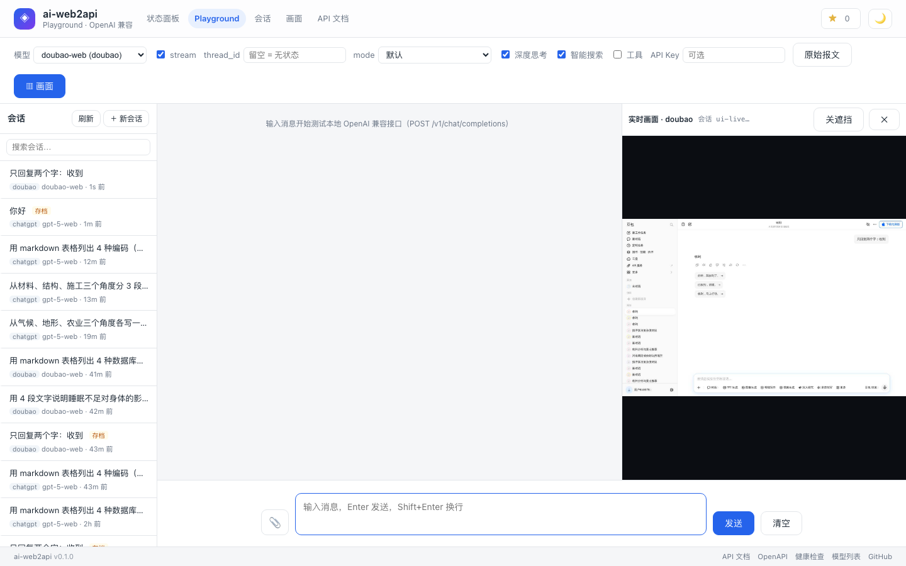
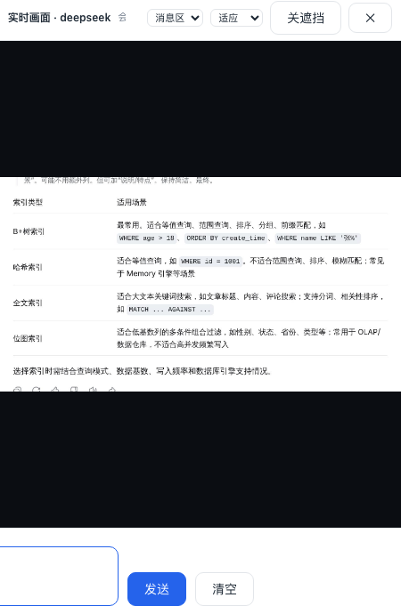
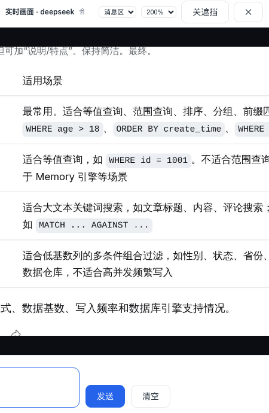

# 实时浏览器画面（Live View / Remote Control）— 设计，待 review

> 状态：**P1 已实现（只读直播）** —— `screen.jpg` / `stream.mjpg` / `screen/state` + `/ui/browser.html`；
> P2（输入注入）/ P3（X11 整窗）/ WS / 认证仍待定。目标：让 UI 能**实时看到**指定 provider 的浏览器画面，
> 并（可选）**直接操作它** —— 最主要的价值是把「手动登录（验证码/扫码/OAuth）」从宿主 CLI 搬进 UI。

## 1. 场景与非目标

**场景**
- **A（主）在 UI 里完成手动登录**：点「开始登录」→ 直播看到登录页 → 在 UI 里输手机号/点验证码/扫码 → 服务自动保存登录态。**不再需要**宿主跑 `login.sh` + 导 state。
- **B 观测/调试**：自动化卡住时看页面到底停在哪（选择器失配、风控页、loading 遮罩）。
- **C（可选）遥控台**：点击/输入/滚动/切标签，当"网页版 Playwright 遥控器"。

**非目标**：替代 Playwright 自动化；多人协作/共享控制；录屏归档。

## 2. 现有基础

- 一次性截图已有：`POST /admin/{p}/login/screenshot`（写盘 `login_error.png`）+ `GET`（回 PNG）
- 调试已有：`GET /admin/{p}/debug/dom?selector=`、`POST /admin/{p}/debug/probe`
- 浏览器模型：**单实例多 context**（每 provider 一个 context，独立登录态）；Docker 里 headful 走 Xvfb，headless 也能 `page.screenshot`
- 前端：3 个静态页 + `common.js`（已封装 `api()`/`toast()`/`copyText()`），**尚无 WebSocket 使用**

## 3. 性能实测（决定帧率与画质）

真实页面（kimi.com，1440×900，headless，8 次取中位）：

| 配置 | 单帧耗时 | 帧大小 | 折算 |
|---|---|---|---|
| JPEG q=80（默认） | 16.6 ms | 44 KB | 5 fps → 8% 单核 / 220 KB/s |
| **JPEG q=50** | **16.5 ms** | **31 KB** | **5 fps → 8% 单核 / 155 KB/s** |
| 720×450 JPEG q=50 | 16.6 ms | **9 KB** | 10 fps → 16% 单核 / 90 KB/s |

**结论**：耗时几乎与画质/尺寸无关（约 16ms 是 CDP 往返 + 编码的固定成本），
**真正的成本是带宽与 CPU 占用率**，不是单帧延迟 → 简单的 `page.screenshot` 循环（5–10 fps）就够用，
**不必**引入 CDP `Page.startScreencast`（可作为后续优化，收益是帧 diff 降 CPU）。

## 4. 方案对比

| 方案 | 帧率 | CPU | 可控制 | 能看到弹窗/新标签 | 平台 |
|---|---|---|---|---|---|
| **A 轮询截图**（前端定时换 ``） | ≤2 fps | 低 | ✗ | ✗ | 全平台，改动最小（P0） |
| **B MJPEG 推流**（服务端循环 + `multipart/x-mixed-replace`） | 5–15 fps | 中 | ✗ | ✗ | 全平台（**推荐 P1**） |
| C CDP screencast | 15–30 fps | 低 | 需另做输入注入 | ✗ | Chromium |
| D X11 抓屏（容器内 `ffmpeg -f x11grab :99`） | 15–30 fps | 中 | ✗（要 xdotool） | **✓ 整个窗口（含 OAuth/扫码弹窗）** | 仅 Docker/Linux + Xvfb（P3） |
| E noVNC（x11vnc + websockify） | 15–30 fps | 中 | ✓ | ✓ | 需额外进程/端口，与"纯 Python 服务"风格不符（不建议） |

**推荐路线**：**P0 轮询 → P1 MJPEG → P2 输入注入 → P3（可选）X11 抓屏**。

## 5. 详细设计

### 5.1 接口

| 方法 | 路径 | 说明 |
|---|---|---|
| GET | `/admin/{p}/screen.jpg?quality=50&clip=…&thread_id=…` | **单帧** JPEG（`Cache-Control: no-store`）。P0 前端轮询它即可"近乎实时"，零新依赖 |
| GET | `/admin/{p}/stream.mjpg?fps=5&quality=50&clip=…&thread_id=…` | **MJPEG 流**（`multipart/x-mixed-replace; boundary=frame`），`` 原生支持，无需 JS 解析（P1） |
| GET | `/admin/{p}/screen/state?thread_id=…` | `{available, shown_thread_id, page_url, viewport, viewers, fps, busy, error?}` |
| WS | `/admin/{p}/live` | 双向：帧下行 + 输入上行。**P2+ 可选 —— 先不做**，理由见 §8 |
| POST | `/admin/{p}/screen/input` | 备选（无 WS 也能控制）：`{type:"click|move|wheel|key|text", …}`（P2） |

> 先做 A/B 两个只读接口就能覆盖 90% 价值（观测 + 看登录页）。

### 5.2 服务端

- 新模块 `src/ai_web2api/browser/live.py`：
  - **每 provider 一个采集任务**，多观众**扇出**同一帧（不重复截图）；**最后一个观众离开即停**（+ 5s 宽限），无人观看时零开销。
  - 帧参数：默认 `fps=5`、`quality=50`、`max_width=1280`（超出等比缩放）；`clip` 可选（例如只看 `.chat-content-item-assistant`）。
  - **取页策略**（P1 修正）：① `?thread_id=` 指定的会话 → ② 该 provider **最近使用**的会话页面
    （按 `last_used` 倒序）→ ③ `context.pages[-1]`；**没有 context 时默认不创建**。
    ⚠ ②必须按"最近使用"排序——**曾按 dict 插入顺序（= 最早创建）取页，导致"正在聊 A，画面却是 B"**；
    现在画面跟随你正在用的会话，`/ui/browser.html?provider=X&thread_id=Y` 可精确固定（会话页每张卡片有「画面」入口）。
    多会话并存时，同一 context 里每个会话各有一张 page，因此能精确切换。
  - **与自动化互斥**：截图是只读，但会占 CPU/CDP → 检测到该 provider 有活跃请求时**自动降帧**（5→1 fps）并在 state 里标注，避免拖慢生成。提供 `?fps=0`（暂停）。
  - 失败处理：页面崩/关 → 推一帧占位（提示原因）并结束循环；`state` 里带 `error`。
- 沿用现有 `BrowserManager`（`get_context` 已是异步+懒加载），**不改**浏览器模型。

### 5.3 前端

- **新页面 `/ui/browser.html`**（"实时画面"）——与状态面板解耦（沿用 threads 页的做法）：
  - 顶部：provider 切换（数据来自 `/admin/status`）、`page_url`、视口尺寸、FPS/画质下拉、暂停/继续、「保存当前帧」。
  - 主体：``（P1）/ 定时轮询（P0）。
  - P2：叠加坐标层 —— 点击 → `POST /screen/input {type:click,x,y}`（按显示尺寸→视口尺寸换算）；键盘输入（含中文 `insert_text`）；滚动；**红色"控制中"标识 + 一键释放**。
- 状态面板 provider 详情：加「**查看画面 →**」按钮，深链 `/ui/browser.html?provider=kimi`。
- 手动登录流程（场景 A）：详情页「开始登录」→ 打开该 provider 的登录页 → 自动跳到画面页 → 用户操作 → 服务端 `check_login()` 通过后落盘 + 提示"已保存登录态"。

### 5.4 安全（**决定：先不加认证**）

> 已定：本轮**不引入认证**（与 `/admin` 现状一致，减少使用摩擦）。用以下措施把风险压到可接受，
> 并在"何时必须补认证"里写清红线。

**替代缓解（不依赖认证）**
1. **控制与观看分离**：`admin.live_view: true`（默认开，你要的功能开箱可用）；
   `admin.live_control: false`（**默认关**）——真正的危险是输入注入（等于交出账号），观看只是"看得见"。
2. **启动即警告**：`live_view` 打开时服务启动打一条 WARNING：
   `直播接口无鉴权：同网段可见浏览器画面；对外暴露请自行加反代鉴权`。
   打开 `live_control` 时再警告一次（更强语气）。
3. **UI 常驻提示**：画面页顶部一条黄色 banner：`本接口未鉴权，请勿对外暴露`。
4. **控制会话超时**：P2 里输入通道 60s 无动作自动断开（防止"忘了在控制"）。
5. **审计日志**：开启/停止观看、每次输入（provider / 来源 IP / 动作）都记日志，便于事后追。
6. **临时禁用**：`admin.live_view: false` 一行关掉，无需重启浏览器。

**何时必须补认证（红线）**
- 端口映射到公网 / 走公网反代；或机器上还有别人的账号在跑自动化；
- 这时必须加：复用 `WEB2API_API_KEY` 或新增 `admin.live_token`（`?token=` 或 `Authorization`），
  校验失败 403；控制类接口强制要求 token（观看可只读放行）。
> 该开关设计上**预留**（接口签名留 `token` 参数位），后续补认证不改前端结构。

### 5.5 测试

- 单测（不依赖浏览器）：帧参数解析与缩放计算；采集循环**多观众只截一次**、无观众自动停；
  `live_view=false` → 403；无可用 page → 降级（占位/`available:false`）。
- 用 stub page 假 `screenshot()`（返回 1×1 JPEG bytes）验证 MJPEG 分帧格式（boundary/headers）。
- 集成（本地）：`GET screen.jpg` → JPEG magic + 尺寸在允许范围；`stream.mjpg` 3 秒内 ≥2 帧。
- Playwright：打开 `/ui/browser.html` 帧数增长；暂停后不再增长；`?provider=` 深链生效。

## 6. 工作量与风险

| 阶段 | 内容 | 规模 |
|---|---|---|
| **P0** | `screen.jpg` 单帧 + `/ui/browser.html` 骨架（轮询 1–2 fps）+ 「查看画面」入口 | 小（~半天） |
| **P1** | `stream.mjpg` 采集循环（扇出/自动停/降帧/state） | 中（~1 天） |
| **P2** | 输入注入（点击/键盘/滚动）+ 坐标换算 + 安全开关 + 审计 | 中偏大（~1–2 天） |
| **P3** | X11 抓屏（看整窗/弹窗；容器加 `ffmpeg`） | 中（~1 天，仅 Docker/Linux） |

**主要风险**：① 截图抢占 CPU 拖慢生成（用降帧 + 默认 5 fps 缓解）；② `/admin` 无鉴权下的安全（必须 P0 就把 token 开关做进去，不能后补）；③ 多观众放大开销（扇出解决）。

## 7. 为什么 P1 不用 WebSocket（价值分析）

问：加 WebSocket 价值有多高？——**P1（只读直播）几乎为零，P2+ 才有价值**。逐项拆：

| WS 常被期待的能力 | 在这里的真实情况 | WS 的增益 |
|---|---|---|
| 传帧 | MJPEG 是**单条长连接 + 二进制**，浏览器 `` 原生渲染、零 JS | ❌ 负：WS 要么 base64（+33% 流量）要么自己写 Blob 渲染 |
| 低延迟 | MJPEG 也没有"每帧一个请求"的开销（同一条 HTTP 响应），实测单帧 16.5ms 才是瓶颈 | ❌ 无差别 |
| **背压/限速** | MJPEG 天然背压：浏览器读得慢 → 服务端写阻塞 → 自动降速 | ❌ WS 要自己实现"丢帧"逻辑，否则内存涨 |
| 动态调参（fps/质量） | 改 `` 即重连生效 | ➖ 打平 |
| 输入（点击/键盘） | 每次点击发一个 `POST /screen/input` 就够（本机毫秒级，点击本身是低频事件） | ➖ 省几条连接，**不是必需** |
| 服务端推状态（自动化开始/结束、暂停） | 1 Hz 轮询 `/screen/state`（几十字节 JSON）够用 | ➖ 打平 |
| **手机端（iOS Safari）** | **iOS Safari 对 `multipart/x-mixed-replace` 的 `` 支持很差**（常白屏） | ✅ **WS 是刚需**（要用手机看） |
| **反向代理** | nginx 默认缓冲会**打断 MJPEG**（需 `proxy_buffering off` / `X-Accel-Buffering: no`）；WS 走 `Upgrade` 通常更省心 | ✅ 走反代时 WS 更稳 |
| **单通道多路复用** | 若以后要做"实时事件面板"（日志 tail、工具调用流、自动化事件），一条 WS 承载多种消息更自然 | ✅ 面向未来 |

**结论与取舍**
- **P1 用 MJPEG**：代码最少（一个 `StreamingResponse` 生成器 + ``）、天然背压不用写丢帧、帧效率最高。约 60–80 行（含扇出/自动停/降帧）。
- **P2 输入仍用 HTTP POST**：不做协议设计、不做重连、不做丢帧；点击/键盘是低频事件，收益足够。
- **升级到 WS 的触发条件**（任一满足即换，届时把"帧源"抽象复用，前端渲染换成 canvas/Blob）：
  1. 需要**手机/iOS 观看**；2. 要经 **nginx 等反代**对外；3. 要做**多路复用**（实时日志/事件流与画面同通道）。
- **成本对比**：MJPEG ≈ 80 行；WS（服务端广播 + 背压丢帧 + 前端重连 + Blob 渲染 + 协议 + 测试）≈ 200–250 行且更易出坑（重连风暴、背压内存、粘包/分片）。
  → **先别做 WS，但把"帧源"接口抽出来**（`async def frames(provider) -> AsyncIterator[bytes]`），换传输层时不动业务。

## 8. 待确认（拍板后开工）

1. **先做哪一档**？建议 **P0 + P1（纯只读）**，先把"看得见"做出来。
2. 要不要**控制**（输入注入）？—— 若目标是"UI 里完成手动登录"，**必须要**（否则看得到验证码也点不了）→ 那 P0 里就该把安全开关一起做。
3. 要不要看**弹窗/新标签**？—— 决定是否做 P3/X11（微信扫码、Google OAuth 弹窗属于这一类）。
4. 安全基线选哪个：**默认关闭 + 必须配 token**（推荐）？还是**只允许 127.0.0.1 访问直播接口**？
5. 默认参数：**5 fps / JPEG q=50 / 最宽 1280**、暂停按钮、生成中自动降到 1 fps —— 可以吗？

---

# 附录：P1 实施规格（**本次范围：只读"实时看见"**）

> 阶段目标：**能实时看见**当前 provider 的浏览器画面。**不做**输入注入 / WS / X11 抓屏 / 认证。

## P1-1 范围

**做**
- `GET /admin/{p}/screen.jpg?quality=&clip=` —— 单帧 JPEG（调试/快照）
- `GET /admin/{p}/stream.mjpg?fps=&quality=&clip=` —— MJPEG 直播（`` 原生）
- `GET /admin/{p}/screen/state` —— `{available, streaming, viewers, fps, quality, page_url, viewport, busy}`
- 新页面 `/ui/browser.html`：provider 切换 + 直播 + fps/画质 + 暂停/继续 + 保存当前帧 + 状态行
- 状态面板 provider 详情加「**查看画面 →**」（深链 `?provider=kimi`）
- 配置：`server.live_view: true`（总开关）、`server.live_control: false`（预留）、`server.live_fps: 5`、`server.live_quality: 50`

**不做（P2+）**
- 输入注入（点击/键盘）→ 故 P1 的价值是"看得见"，登录操作仍在真实窗口/宿主进行
- WebSocket（理由见 §7）、X11 整窗抓屏、认证（按决定；用 §5.4 的非认证缓解）

## P1-2 参数与语义

| 参数 | 取值 | 说明 |
|---|---|---|
| `quality` | 1–95，默认 `live_quality`(50) | 越界夹取；实测 q=50≈31KB/帧 |
| `fps` | 0.2–15，默认 `live_fps`(5) | 直播用；`busy` 时**自动降到 min(fps,1)** |
| `clip` | `x,y,w,h` 4 个非负整数 | 只拍局部（如对话区），是**唯一的服务端带宽杠杆** |

> **不做服务端缩放**（原设计的 `max_width`）：项目无图像库，为一次"缩图"引入 Pillow 不值当；
> 带宽用 `quality` + `clip` 控制，显示尺寸交给前端 CSS。

**页面选择顺序**（不主动创建 context/page，避免"看一眼"把浏览器拉起来）：
1. 该 provider **最近的活跃 thread 页面**（`ThreadSession.page` 且未关闭）
2. 该 provider 已有 context 的 `pages[-1]`
3. 都没有 → `503 {"error":{"message":"没有可截图的页面…"}}`

**接口细节**
- 响应头：`Cache-Control: no-store`；直播额外 `X-Accel-Buffering: no`（防 nginx 缓冲打断 MJPEG）
- `live_view: false` → 三个接口一律 **403**（含可读错误信息）
- **每 provider 一个采集循环**，多观众**扇出同一帧**；首个观众的 `fps/quality` 生效并在 `state` 里展示
- 观众队列容量 **1**（慢消费者丢旧帧，不做积压）
- 最后一个观众离开 → **5s 宽限后停采集**；无人观看时**零开销**

## P1-3 安全（无认证，按已定）

- 默认 `live_view: true`（开箱可用）+ 服务启动打 WARNING：`直播接口无鉴权：同网段可见浏览器画面`
- `live_control` 字段**预留**且默认 `false`（P1 无输入通道，写上只为配置形态稳定）
- UI 画面页顶部常驻黄条：`本接口未鉴权，请勿对外暴露`
- 审计：开始/结束观看各记一行日志（provider / 观众数）
- 红线见 §5.4：公网暴露必须自加反代鉴权

## P1-4 验收标准

1. `screen.jpg` 返回 JPEG（`FF D8`）且尺寸=页面视口；`quality=10` 体积明显小于 `quality=90`
2. `stream.mjpg` 3 秒内 ≥2 帧、boundary 格式正确；关闭页面后 `state.viewers` 归 0 且采集循环停止
3. `live_view: false` → 三接口 403；无可用页面 → 503 且文案可读
4. 生成中 `state.busy=true` 且帧率自动降到 1（日志可见），**直播开启时普通 completion 仍成功**
5. `/ui/browser.html`：能看图、暂停后帧不再增长、切 provider 生效、`?provider=` 深链生效
6. 页面显示 `page_url` + 视口尺寸 + 观众数；黄条提示存在

## P1-5 提交拆分

| # | 提交 | 内容 |
|---|---|---|
| C1 | `feat(live): single-frame screen.jpg + screen/state + config` | 取页/截帧/错误语义/`SerialGate.busy`/访问器 + 单测 |
| C2 | `feat(live): MJPEG stream with fan-out and auto-stop` | 采集循环/扇出/丢帧/宽限自停 + 单测 |
| C3 | ✅ `ui(live): browser.html live view page + entry + docs` | 页面/nav/入口按钮/README + 静态与 Playwright 验证 |

### P1 实测（容器内，DeepSeek 真实页面）
```
screen.jpg   HTTP 200 image/jpeg 34.7KB（视口 1440x900）
screen/state {"available":true,"page_url":"https://chat.deepseek.com/a/chat/s/…","viewport":{1440,900},"viewers":0}
stream.mjpg  HTTP 200 multipart/x-mixed-replace  3 秒 13 帧（≈4.3fps，目标 5）451KB
/ui/browser.html?provider=deepseek  naturalWidth=1440 正常成帧；暂停 → viewers=0 且 streaming=false（自动停采集）
```

## Playground 左右分栏（左侧对话 + 右侧实时画面）

便于"边聊边对"：回复与站点页面同时可见，一眼看出是站点侧慢还是我们慢（配合 `[timeline]` 日志）。



| 行为 | 说明 |
|---|---|
| 开关 | 工具栏「▥ 画面」；记忆在 `localStorage.aiw2api_live`（默认开） |
| 跟随模型 | 模型 → provider 由 `/admin/status` 映射，切模型自动切画面 |
| 跟随会话 | `#threadId` 有值时传 `?thread_id=`（画面钉到同一会话）；接口支持"跟随最近使用" |
| 省资源 | 只在面板可见**且**标签页可见时才开流（`visibilitychange` + 收起即停） |
| 无页面时 | 显示"暂无打开的页面 —— 发一条消息后会自动出现"，并**每 3s 自动重试** |
| 关遮挡 | 「关遮挡」按钮 → `POST /admin/{p}/dismiss`（繁忙提示/协议弹窗挡住输入时很有用） |
| 窄屏 | ≤900px 自动上下分栏（对话在上、画面在下） |

> 注：画面是**只读直播**（P1 设计）；**交互（点击/拖拽/输入）设计见 [`LIVE_CONTROL.md`](LIVE_CONTROL.md)**，由 `server.live_control` 开关控制（默认 false）。

## 画面清晰度：三个手段（v0.1.x）

"字迹糊"的根因是**缩放比**：整页 1440px 截屏塞进 ~450px 的窄栏 = 缩到 0.3，字当然看不清。三个手段叠加：

| 手段 | 参数 | 效果（实测 deepseek） |
|---|---|---|
| ~~① 只裁消息区~~（**已改为一律整页**，`crop` 仅作接口能力保留） | `?crop=last`（API 可选） | 1440×900/370KB → **1616×676/132KB**（2x 设备像素下）；窄栏里字放大 2–3 倍 |
| **② 截图 2x 超采样** | `browser.device_scale_factor: 2` | 缩小展示时**字迹锐利**（CSS 像素不变，选择器/点击不受影响；字节 ≈2–3 倍） |
| **③ 缩放 + 滚动** | Playground 头部「缩放：适应/100%/150%/200%」 | 200% 时**原生大小以上**，字完全清晰（自动跟随到底部看最新内容） |

「范围」下拉可切回**整页**（`crop=full`，看全貌/看弹窗）；「关遮挡」按钮可关掉挡住输入的弹窗。

| 适应（整幅可见） | 200%（字最清楚，可滚动） |
|---|---|
|  |  |

**带宽/CPU 提示**：2x + `quality=75` 下每帧约 130KB（裁消息区）/ 370KB（整页）；
5fps 时约 0.65 / 1.8 MB/s。要省带宽：`?quality=60`、`?fps=2`，或把 `device_scale_factor` 调回 1。
生成中帧率会自动降到 `live_fps` 的 1/5（避免抢占自动化），因此看"边写边对"时画面会稍顿。

**裁剪实现**：`crop_box_for_last()` → 取最后一个正文容器的 `bounding_box()`，四周留 `crop_padding`(28px)，
**底部对齐**（长回答优先显示最新写出的部分），失败回退整页（拿不到元素/页面在动的那一帧）。
