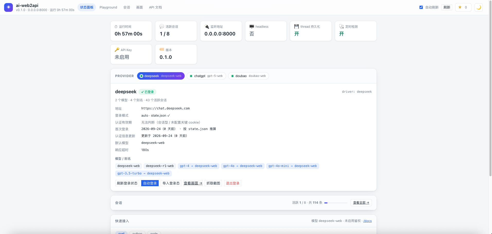
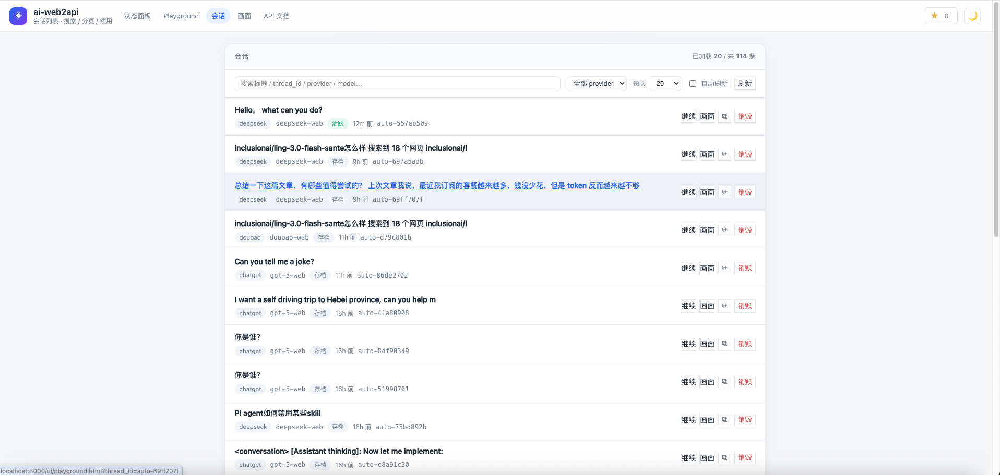
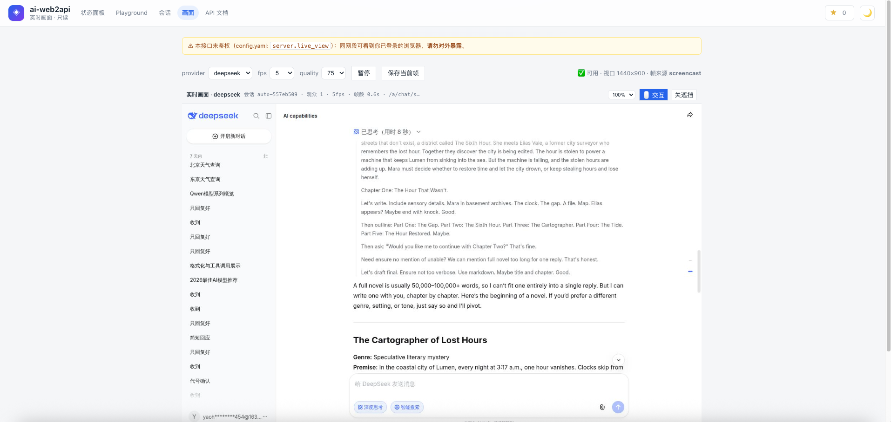

# UI 截图

以下是 `/ui/` 各页面的当前截图。

## Status Dashboard

提供者登录态、到期倒计时、模型/别名、一键导入登录态。

## Playground

聊天 + 实时画面右栏、思考面板、附件上传、工具调用测试、原始报文复制。

## Threads

会话卡片列表、搜索、provider 过滤、分页、「继续」入口。

## Live View + 交互

实时画面、缩放、点击/拖拽/输入/滚轮交互（需 `server.live_control: true`）。
